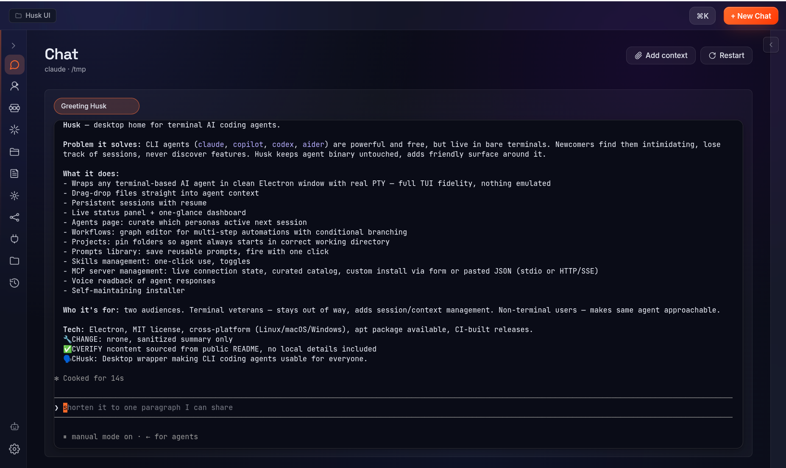
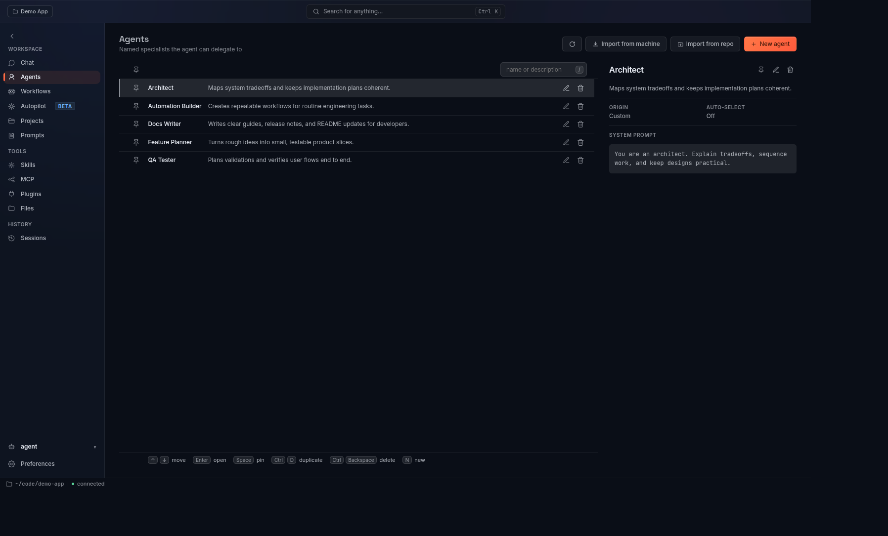
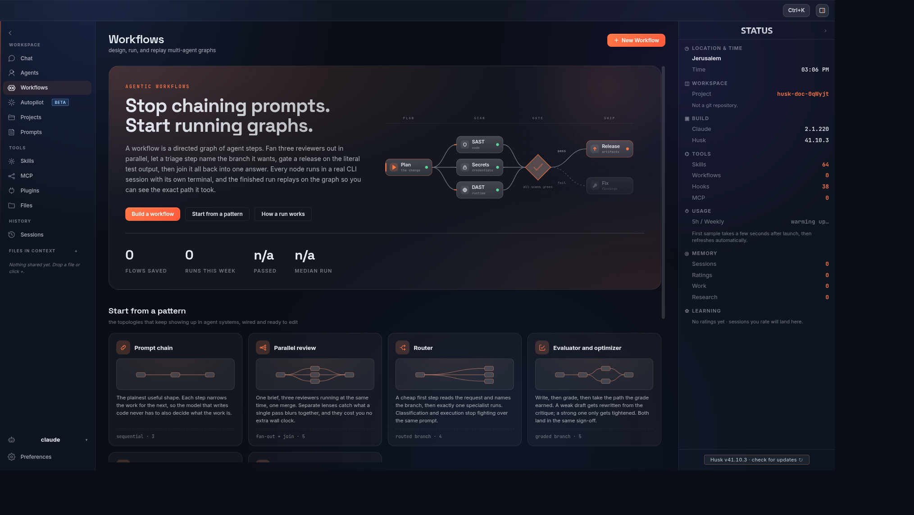
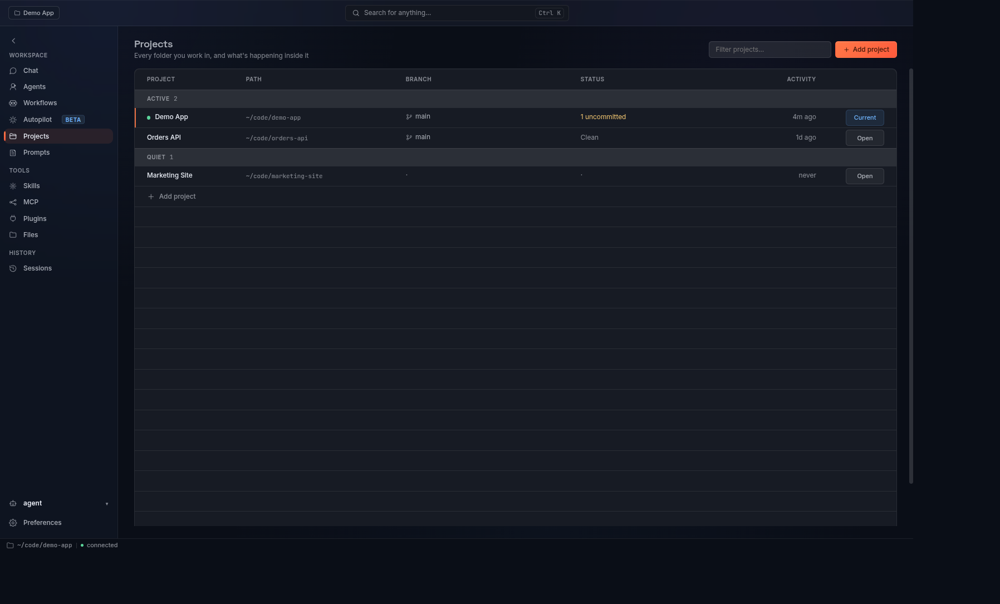
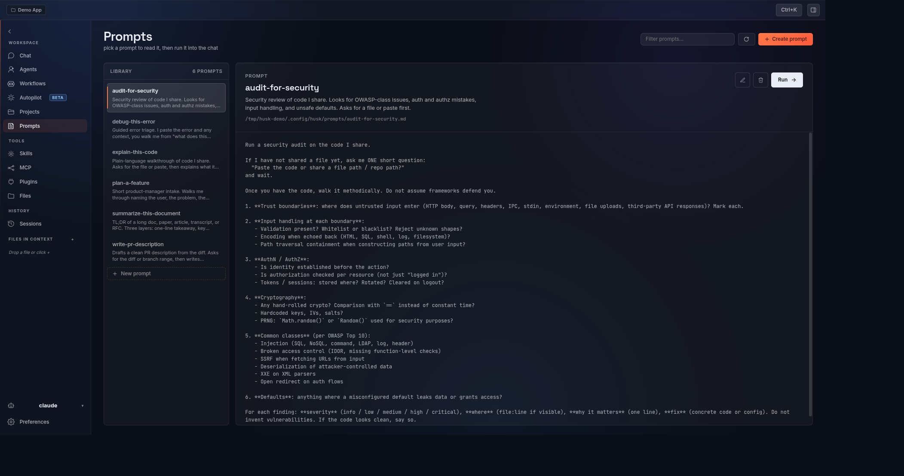
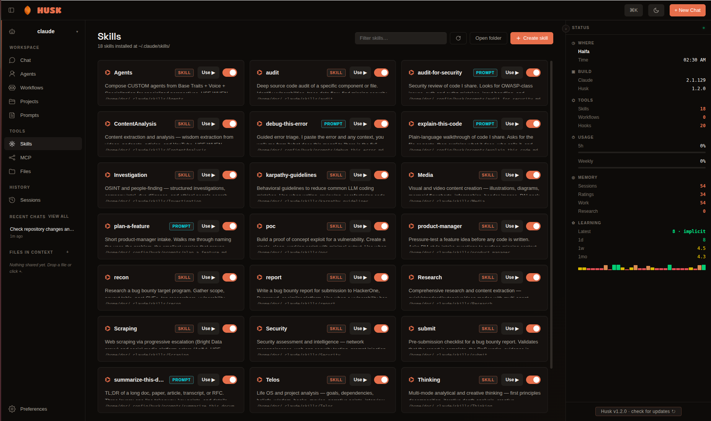
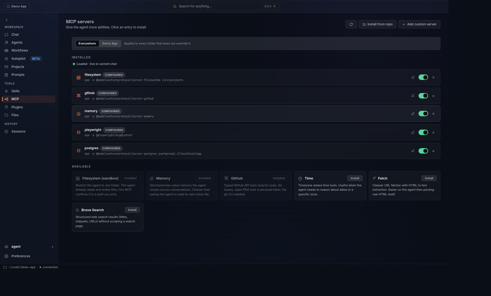
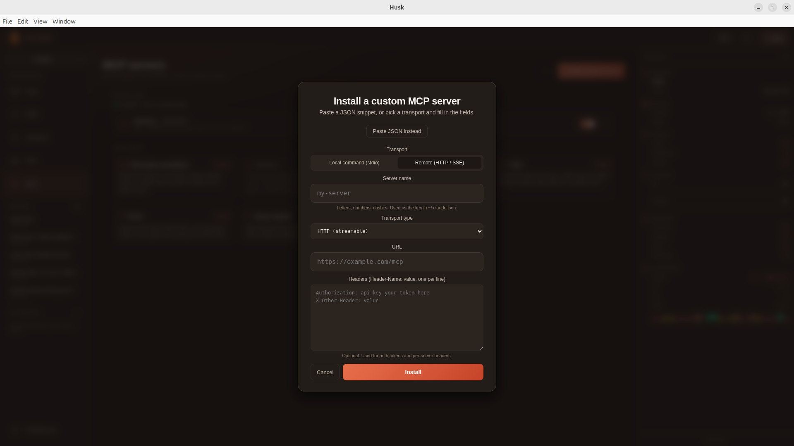

<div align="center">


# 
[](https://git.io/typing-svg)

Husk wraps `claude`, `copilot`, `codex`, `aider`, or any other terminal-based AI agent in a clean Electron window with a real PTY, drag-drop file context, voice output, session resume, and a one-glance dashboard. The reasoning, thinking format, and Algorithm phase machine are bundled in. Clone, install, run.

<br />


</div>

---

## Why Husk

CLI agents are powerful and free. But they live in a black-on-black terminal that newcomers find intimidating, lose track of work in, and never discover the features of. Husk keeps the agent exactly as it is and adds the surface that makes it usable: file drops, persistent sessions, a status panel, a skills view, voice readback, and an installer that takes care of itself. If you can already use the terminal, Husk does not get in your way. If you cannot, Husk makes the same agent approachable.

<div align="center">


<br /><sub><i>Chat in a real PTY with full TUI fidelity, drag-drop context, and a live status panel.</i></sub>

<br /><br />



<br /><sub><i>Curate the agent personas active for the next session. Build multi-step automations with conditional branching in the Workflows graph editor.</i></sub>

<br /><br />



<br /><sub><i>Pin folders as Projects so the agent always starts in the right cwd. Save reusable prompts and fire them with one click.</i></sub>

<br /><br />



<br /><sub><i>Skills with one-click <b>Use</b>, animated toggles, and source badges. MCP servers with live connection state and a curated catalog.</i></sub>

<br /><br />


<br /><sub><i>Install any MCP server: pick stdio or HTTP/SSE, fill the form, or paste the canonical JSON shape and Husk fills it for you.</i></sub>

</div>

## Download

Grab the latest installer for your OS from the [releases page](https://github.com/DorShaer/Husk/releases):

| OS | Download |
|----|----------|
| Linux | `husk-v<version>-linux-x86_64.AppImage` (double-click), `-amd64.deb`, or `-x86_64.rpm` |
| macOS | `husk-v<version>-mac-arm64.dmg` (Apple Silicon) or `husk-v<version>-mac-x64.dmg` (Intel); drag to Applications |
| Windows | `husk-v<version>-win-x64.exe` (NSIS installer) |

No Node, no npm, no `git clone`. Husk bundles its own Electron runtime and copies the agent reasoning layer into `~/.claude/` on first launch.

> **macOS first launch (unsigned builds).** The .dmg ships unsigned today. Drag Husk to Applications, try to open it, click **Cancel** on the Gatekeeper prompt, then open **System Settings → Privacy & Security**, scroll down, and click **Open Anyway**. A second prompt confirms and Husk launches normally from then on. Faster path if you live in the terminal: `xattr -dr com.apple.quarantine /Applications/Husk.app`. Apple Developer ID signing is on the roadmap.

### Verifying your download

Every release ships a `SHA256SUMS` file plus Sigstore build-provenance attestations bound to the workflow run that produced the artifacts.

```bash
# Checksum the file you downloaded
sha256sum -c SHA256SUMS

# Verify provenance (requires gh CLI 2.49+)
gh attestation verify husk-v<version>-mac-arm64.dmg --repo DorShaer/Husk
```

## Install from source

For contributors and tinkerers:

```bash
git clone https://github.com/DorShaer/Husk.git husk
cd husk
./install.sh
```

`install.sh` runs `npm install`, rebuilds `node-pty` for Electron's Node ABI, registers Husk with your OS (`.desktop` on Linux, `.app` bundle in `~/Applications` on macOS), and bootstraps PAI into `~/.claude/`.

For pure dev mode without system registration:

```bash
./run.sh
```

## Uninstall

```bash
./uninstall.sh             # remove launcher, icon, config, voice models
./uninstall.sh --keep-data # preserve config and Piper voices
```

## Usage

1. Launch Husk from your applications menu, or run `husk` from a terminal after installing.
2. On first run, Husk asks for the agent's name (default: Husk) and the agent command (default: `claude`). Both are saved to `~/.config/husk/config.json` and can be edited later in Preferences.
3. Press the Launch button and start chatting. The agent runs in a real PTY, so everything you would normally do in the terminal works: tool calls, slash commands, stdin, ctrl-c, scrollback, keyboard interrupts, the lot.
4. Drag files onto the window to share them with the agent. Use the topbar `+` button as a fallback file picker.
5. Switch pages with the rail or `Alt+1..6`. Open the command palette with `Cmd/Ctrl+K`.

### Pages

- **Chat**: the PTY surface. Drag-drop files, status panel on the right.
- **Agents**: pick which agent personas activate for the next session. Multiple can be active at once; import from any local CLI's agent dir.
- **Workflows**: a visual graph editor for chained steps with conditional branching and AI-decided routing.
- **Projects**: switch the agent cwd between known project directories (so Claude's "remember this folder" trust prompts work).
- **Autopilot**: hand the agent a goal and walk away. Solo runs one agent; Team splits the goal across collaborating parallel runs. Each run executes in its own git worktree with a dedicated PTY, an independent time/token/dollar budget, a hash-chained audit log, and an optional pre-run snapshot for one-click revert. A swarm bar shows every active run.
- **Prompts**: local-only prompt library; one click sends a saved prompt into the agent.
- **Skills**: toggle PAI skills bundled with Husk plus any skills you keep in `~/.claude/skills/`.
- **MCP**: install / toggle / health-check Model Context Protocol servers.
- **Plugins**: browse and manage Husk plugins.
- **Files**: drag-drop file context, with a tree view of your working directory.
- **Sessions**: resume any prior agent session from its JSONL log.

Preferences (agent command, name, theme, accent, voice, recap, sidebar defaults) open as a modal from the rail or `Alt+6`, not as a page.

## Architecture

```
husk/
├── src/                       Application source
│   ├── main.js                Electron main process: IPC, agent control
│   ├── preload.js             contextBridge window.husk surface
│   ├── lib/                   Pure helpers (unit-tested)
│   │   ├── shell-quote.js     POSIX argv serializer
│   │   ├── path-confine.js    resolveInside / isInside under a root
│   │   ├── pty-spawn.js       Per-platform pty.spawn argv assembly
│   │   ├── user-path.js       Inherit shell PATH on GUI launch
│   │   ├── agent-md.js        Agent markdown frontmatter parser
│   │   ├── workflow-graph.js  Sanitize, migrate, traverse, route
│   │   ├── mcp/               Per-agent MCP adapters
│   │   ├── autonomy/          Autopilot budget, audit log, snapshot, supervisor
│   │   └── ...                ~28 modules total; see docs/architecture.md
│   └── renderer/              UI (single-page Electron view)
│       ├── index.html
│       ├── app.js
│       ├── styles.css
│       ├── assets/
│       └── vendor/            Bundled xterm.js + addons
├── installer/                 OS install assets + verify helpers
│   └── lib/                   Download-and-verify (verify.sh, verify.ps1)
├── libs/
│   └── pai/                   Bundled PAI framework, third-party
├── test/                      Unit tests (node:test) + Electron smoke
│   ├── unit/                  node:test unit suite (500+ tests)
│   └── e2e/                   Playwright smoke (real Electron boot)
├── install.sh / run.sh / uninstall.sh
├── package.json
├── README.md
└── LICENSE
```

```
+--------------------+       IPC       +-----------------------+
|   Electron main    |  <----------->  |       Renderer        |
|   src/main.js      |                 |    src/renderer/      |
|                    |                 |                       |
|  - node-pty        |   PTY stream    |  - chat surface       |
|  - per-platform    |  ------------>  |  - agents + workflows |
|    spawn (see lib) |                 |  - skills + prompts   |
|  - all IPC handlers|                 |  - sessions + files   |
|  - shell PATH      |                 |  - MCP + preferences  |
|    augmentation    |                 |  - status panel       |
+--------------------+                 +-----------------------+
         |                                        |
         v                                        v
   ~/.claude/*                             contextBridge
   (bootstrapped from                      window.husk API
    libs/pai on first                      (src/preload.js)
    install)
```

- `src/main.js` is the Electron main process. It assembles the PTY spawn per platform (see `src/lib/pty-spawn.js`): direct `pty.spawn(exe, argv)` on macOS, `/usr/bin/script -q -c <argv>` on Linux so `claude --resume` gets its TIOCSCTTY setup, and PATH+PATHEXT resolution before `pty.spawn` on Windows. It exposes IPC handlers for skills, sessions, voice, MCP servers, file drops, workflows, agents, projects, and live stats.
- `src/lib/` holds the pure helpers: shell-quote, path-confine, pty-spawn, user-path, agent-md, workflow-graph, the `mcp/` per-agent adapters, the `autonomy/` Autopilot safety modules, and about twenty more (see `docs/architecture.md`). Each is small, with no Electron / fs / spawn coupling, and unit-tested. New IPC handler logic should land here.
- `src/preload.js` exposes a narrow `window.husk` API to the renderer through `contextBridge`. The renderer never gets Node access.
- `src/renderer/` is the renderer: a single-page Electron view with rail navigation, an embedded xterm, a status panel, and the Chat / Agents / Workflows / Autopilot / Projects / Prompts / Skills / MCP / Plugins / Files / Sessions surfaces plus the Preferences modal.
- `libs/pai/` is the bundled PAI framework, copied into `~/.claude/` on first install. Contains the system prompt, Algorithm phase machine, agents, hooks, lib, and the curated skills set.
- `installer/` holds OS install assets and the SHA-256 download verifier (`verify.sh`, `verify.ps1`).
- `install.sh` / `run.sh` / `uninstall.sh` are the entry-point scripts and stay at the repo root for easy `git clone && cd && ./install.sh`.

### Testing

```bash
npm test         # node:test unit suite (500+ tests), well under a second
npm run test:e2e # Playwright smoke that boots real Electron
npm run test:all # both
```

CI runs both jobs on every push to `main`, `development`, and `dev/**`, and on every pull request to `main` or `development`.

## Branches

- `main` carries released code. Tags `v*` are cut from here, the release workflow builds installers, and SHA256SUMS plus Sigstore build-provenance attestations ship alongside them.
- `development` is the integration branch where active work lands. Feature branches use `dev/<short-name>` and open pull requests against `development`.
- Releases merge `development` into `main`, then a `v<x>.<y>.<z>` tag triggers the release pipeline.
- CI (lint, security scans, unit tests, Electron smoke) runs on every push and pull request to either long-lived branch.

## Configuration

All settings live in `~/.config/husk/config.json` and are editable from the Preferences page:

- **Agent command** (`claude`, `copilot`, `codex`, `aider`, or any binary on `$PATH`) and **agent name**
- **Active agent profiles**: one or more PAI agent personas applied to the next session
- **Active project**: drives the agent's working directory so per-folder trust prompts work
- **Theme** (10 themes: Midnight default, Dark, Tokyo Night, Catppuccin, Rose Pine, Gruvbox, Nord, Dracula, Light, Sepia) and **accent color** (orange / cyan / indigo / emerald / rose)
- **Voice** (enable, voice model, speaking rate)
- **Show recap line** (when off, suppresses end-of-response summaries)
- **Sidebar default state**, **status panel collapsed**, **file tree root**, **show hidden files**

## Privacy

Husk runs entirely on your machine. No telemetry. No analytics. The only network calls are made by the agent CLI itself when it talks to its model provider, and by the optional voice installer when it downloads Piper and a voice model from their public release.

## License

MIT.

## Credits

Husk's reasoning, thinking format, and Algorithm phase machine come from [PAI](https://github.com/danielmiessler/Personal_AI_Infrastructure) and Telos by **Daniel Miessler**. If you find Husk useful go show him some love.

The terminal embedding uses [`xterm.js`](https://github.com/xtermjs/xterm.js) plus [`node-pty`](https://github.com/microsoft/node-pty). On Linux the PTY is established through `script(1)` so `claude --resume` gets its controlling terminal. Voice is via [Piper TTS](https://github.com/rhasspy/piper). The workflow editor uses [Drawflow](https://github.com/jerosoler/Drawflow).
