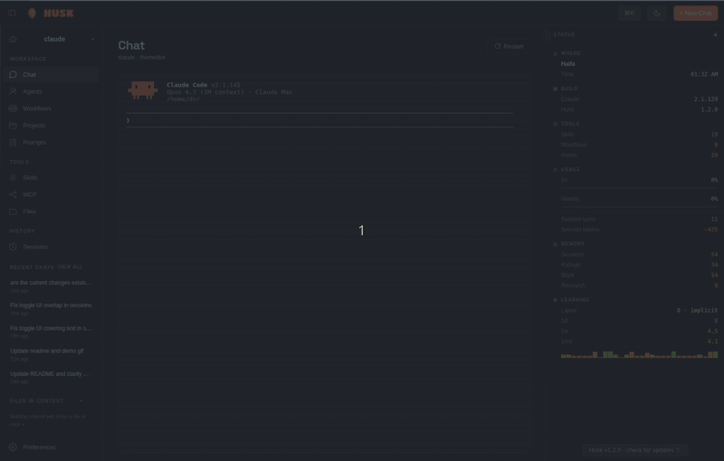

<div align="center">


# Husk

[](https://git.io/typing-svg)

Husk wraps `claude`, `copilot`, `codex`, `aider`, or any other terminal-based AI agent in a clean Electron window with a real PTY, drag-drop file context, voice output, session resume, and a one-glance dashboard. The reasoning, thinking format, and Algorithm phase machine are bundled in. Clone, install, run.

<br />



</div>

---

## Why Husk

CLI agents are powerful and free. But they live in a black-on-black terminal that newcomers find intimidating, lose track of work in, and never discover the features of. Husk keeps the agent exactly as it is and adds the surface that makes it usable: file drops, persistent sessions, a status panel, a skills view, voice readback, and an installer that takes care of itself. If you can already use the terminal, Husk does not get in your way. If you cannot, Husk makes the same agent approachable.

<div align="center">


<br /><sub><i>Chat in a real PTY with full TUI fidelity, drag-drop context, and a live status panel.</i></sub>

<br /><br />


<br /><sub><i>Skills with one-click <b>Use</b>, animated toggles, and source badges. MCP servers with live connection state and a curated catalog.</i></sub>

<br /><br />


<br /><sub><i>Install any MCP server: pick stdio or HTTP/SSE, fill the form, or paste the canonical JSON shape and Husk fills it for you.</i></sub>

</div>

## Download

Grab the latest installer for your OS from the [releases page](https://github.com/DorShaer/Husk/releases):

| OS | Download |
|----|----------|
| Linux | `Husk-<version>.AppImage` (double-click), `.deb`, or `.rpm` |
| macOS | `Husk-<version>.dmg` (drag to Applications); both Apple Silicon and Intel |
| Windows | `Husk-<version>-Setup.exe` (NSIS installer) |

No Node, no npm, no `git clone`. Husk bundles its own Electron runtime and copies the agent reasoning layer into `~/.claude/` on first launch.

> macOS first launch: the .dmg is unsigned today. Right-click the app, choose **Open**, confirm once. Apple Developer ID signing is on the roadmap.

## Install from source

For contributors and tinkerers:

```bash
git clone https://github.com/DorShaer/Husk.git husk
cd husk
./install.sh
```

`install.sh` runs `npm install`, rebuilds `node-pty` for Electron's Node ABI, registers Husk with your OS (`.desktop` on Linux, `.app` bundle in `~/Applications` on macOS), and bootstraps PAI into `~/.claude/`.

For pure dev mode without system registration:

```bash
./run.sh
```

## Uninstall

```bash
./uninstall.sh             # remove launcher, icon, config, voice models
./uninstall.sh --keep-data # preserve config and Piper voices
```

## Usage

1. Launch Husk from your applications menu, or run `husk` from a terminal after installing.
2. On first run, Husk asks for the agent's name (default: Husk) and the agent command (default: `claude`). Both are saved to `~/.config/husk/config.json` and can be edited later in Preferences.
3. Press the Launch button and start chatting. The agent runs in a real PTY, so everything you would normally do in the terminal works: tool calls, slash commands, stdin, ctrl-c, scrollback, keyboard interrupts, the lot.
4. Drag files onto the window to share them with the agent. Use the topbar `+` button as a fallback file picker.
5. Switch pages with the rail or `Alt+1..5`. Open the command palette with `Cmd/Ctrl+K`.

## Architecture

```
husk/
├── src/                       Application source
│   ├── main.js                Electron main process: PTY, IPC, agent control
│   ├── preload.js             contextBridge window.husk surface
│   └── renderer/              UI (single-page Electron view)
│       ├── index.html
│       ├── app.js
│       ├── styles.css
│       ├── assets/
│       └── vendor/            Bundled xterm.js + addons
├── libs/
│   └── pai/                   Bundled PAI framework, third-party
├── installer/                 OS install assets (icon)
├── install.sh / run.sh / uninstall.sh
├── package.json
├── README.md
└── LICENSE
```

```
+--------------------+       IPC       +---------------------+
|   Electron main    |  <----------->  |      Renderer        |
|   src/main.js      |                 |   src/renderer/      |
|                    |                 |                      |
|  - node-pty        |   PTY stream    |  - chat surface      |
|  - script(1)       |  ------------>  |  - skills + prompts  |
|  - skill IPC       |                 |  - sessions          |
|  - session IPC     |                 |  - files tree        |
|  - voice IPC       |                 |  - MCP page          |
|  - mcp IPC         |                 |  - preferences       |
|  - stats IPC       |                 |  - status panel      |
+--------------------+                 +----------------------+
         |                                       |
         v                                       v
   ~/.claude/*                            contextBridge
   (bootstrapped from                     window.husk API
    libs/pai on first                     (src/preload.js)
    install)
```

- `src/main.js` spawns the chosen CLI via `script -q -c <cmd>` so the agent gets a real controlling terminal. It exposes IPC handlers for skills, sessions, voice, MCP servers, file drops, and live stats.
- `src/preload.js` exposes a narrow `window.husk` API to the renderer through `contextBridge`. The renderer never gets Node access.
- `src/renderer/` is the renderer: a single-page Electron view with rail navigation, an embedded xterm, a status panel, and the Skills / Sessions / Files / MCP / Preferences surfaces.
- `libs/pai/` is the bundled PAI framework, copied into `~/.claude/` on first install. Contains the system prompt, Algorithm phase machine, agents, hooks, lib, and the curated skills set.
- `installer/` holds OS-level install assets (icon for the desktop entry).
- `install.sh` / `run.sh` / `uninstall.sh` are the entry-point scripts and stay at the repo root for easy `git clone && cd && ./install.sh`.

## Configuration

All settings live in `~/.config/husk/config.json` and are editable from the Preferences page:

- **Agent command** and **agent name**
- **Theme** (dark / light) and **accent color** (orange / cyan / indigo / emerald / rose)
- **Voice** (enable, voice model, speaking rate)
- **Show recap line** (when off, suppresses end-of-response summaries)
- **Sidebar default state**, **file tree root**, **show hidden files**

## Privacy

Husk runs entirely on your machine. No telemetry. No analytics. The only network calls are made by the agent CLI itself when it talks to its model provider, and by the optional voice installer when it downloads Piper and a voice model from their public release.

## License

MIT.

## Credits

Husk's reasoning, thinking format, and Algorithm phase machine come from [PAI](https://github.com/danielmiessler/Personal_AI_Infrastructure) and Telos by **Daniel Miessler**. If you find Husk useful go show him some love.

The terminal embedding uses [`xterm.js`](https://github.com/xtermjs/xterm.js), `node-pty`, and `script(1)`. Voice is via [Piper TTS](https://github.com/rhasspy/piper).
